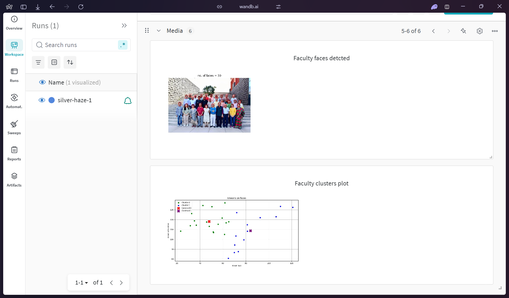
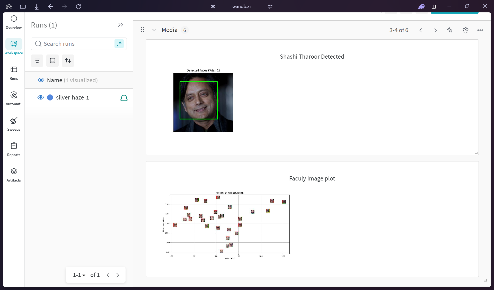
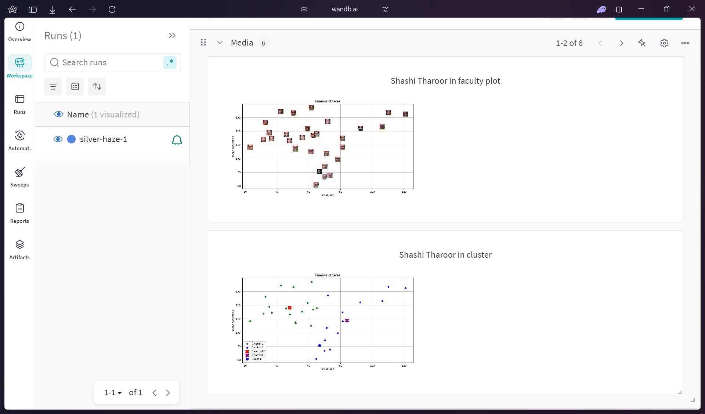

### Wandb Screenshots

### Kaggle Link
[kaggle notebook link](https://www.kaggle.com/code/eshansrirambhatla/notebook96399e1e56)

#### 1. What are the common distance metrics used in distance-based classification algorithms? 

#### 2. What are some real-world applications of distance-based classification algorithms? 

#### 3. Explain various distance metrics. 

#### 4. What is the role of cross validation in model performance? 

#### 5. Explain variance and bias in terms of KNN? 

1. Common distance metrics used in kmeans are euclidian, manhattan mahalanobis and more
2. real world applications of distance based algos include faces detection, image matching spam detction and more
3. euclidian - It is the root of the sum of x^2 + y^2 or the length of the line between two point, manhattan is the sum of the x difference and y difference and mahalanobis checks distance of a point from a distibution
4. Cross validation allows us to check and fine tune model performance using validation sets before finalizing on a model
5. Bias is low and variance is high when we have a small k or the model overfits, bias is high and variance is low when we have a really large k or the model underfits